# 概述
针对jkorm框架进行相关的性能测试
1. 对`jkorm`的不同级别(封装层面不同)的查询api进行性能测试
2. 针对`jkorm`/`mybatis`2个orm框架进行性能测试

# 测试环境

## 硬件配置

一台老的测试机, 机器上还跑着其他服务, 凑合测试

     CPU：model name:Intel(R) Xeon(R) CPU E5-2620 v2 @ 2.10GHz,cache size: 15360 KB,processor_count : 24
     内存：16G
     网络：千兆网卡
     硬盘：900GB

## 软件配置

     mysql版本： 做db server
     5.6.21

     JDK版本：做db client
     java version "1.8.0_172"
     Java(TM) SE Runtime Environment (build 1.8.0_172-b11)
     Java HotSpot(TM) 64-Bit Server VM (build 25.172-b11, mixed mode)

     JVM参数：
     java -Djava.net.preferIPv4Stack=true -server -Xms1g -Xmx1g -XX:PermSize=128m

# 一、性能测试: jkorm vs jdbc
主要是对orm框架`jkorm`的不同级别的查询api进行性能测试，并与jdbc的查询api做性能对比。

## 测试脚本(db client)

单线程同步调用, 请求数分别为1w/5w/10w的情况下，分别进行如下场景测试, 每种测试进行5轮, 最优结果(耗时最短)：
  - native: 使用原生jdbc来查询
  - db：使用 `net.jkcode.jkmvc.db.Db` 来查询, 对原生jdbc进行封装并简化调用, 理论上性能接近于但小于 native
  - query: 使用 `net.jkcode.jkmvc.query.DbQueryBuilder` 来查询, 用查询构建器来生成sql, 每次调用都创建新的 DbQueryBuilder 实例
  - orm: 使用 `net.jkcode.jkmvc.orm.OrmQueryBuilder` 来查询, 对 DbQueryBuilder 进行封装并添加orm特性, 理论上性能接近于但小于 query
  - queryReuse: 复用 `net.jkcode.jkmvc.query.DbQueryBuilder` 来查询, 复用 DbQueryBuilder 实例, 不用频繁创建, 理论上性能优于 query
  - queryCompiled: 编译好 `net.jkcode.jkmvc.query.DbQueryBuilder` 来查询, 编译好sql直接调用, 理论上性能接近于但小于 db

## 测试代码

```
    /**
     * 原生 | sql
     */
    public fun getMessageByNative(id: Int): MessageEntity?{
        return Db.instance().conn.queryResult("select * from message where id = $id", emptyList()) { rs ->
            if(rs.next()) {
                val msg = MessageEntity()
                msg.id = rs.getInt("id")
                msg.fromUid = rs.getInt("from_uid")
                msg.toUid = rs.getInt("to_uid")
                msg.content = rs.getString("content")
                msg
            }else
                null
        }
    }

    /**
     * db | sql
     */
    public fun getMessageByDb(id: Int): MessageEntity?{
        return Db.instance().queryRow("select * from message where id = $id", emptyList()) { row ->
            val msg = MessageEntity()
            msg.fromRow(row, true)
            msg
        }
    }

    /**
     * orm query
     *
     * 通过jprofile得知, 相对于纯sql, 内存消耗大
     * 其中 char是5w个(是纯sql的5倍), String
     */
    public fun getMessageByOrm(id: Int): MessageEntity?{
        return MessageModel.queryBuilder().where("id", "=", id).findEntity<MessageModel, MessageEntity>()
    }

    /**
     * db query
     *
     * 通过jprofile得知, 内存跟orm差不多
     * findEntity() 跟 findRow{} 差不多
     */
    public fun getMessageByQuery(id: Int): MessageEntity?{
        return DbQueryBuilder().table("message").where("id", "=", id).findRow { row ->
            val msg = MessageEntity()
            msg.fromRow(row, true)
            msg
        }
    }

    /**
     * 复用的db query
     *
     * 通过jprofile得知, 内存跟纯sql差不多
     * 性能在 纯sql 与 orm 之间
     */
    val query: DbQueryBuilder by lazy {
        DbQueryBuilder()
    }
    public fun getMessageByQueryReuse(id: Int): MessageEntity?{
        query.clear()
        return query.table("message").where("id", "=", id).findRow { row ->
            val msg = MessageEntity()
            msg.fromRow(row, true)
            msg
        }
    }

    /**
     * 编译后的 db query
     */
    val csql: CompiledSql by lazy{
        DbQueryBuilder().table("message").where("id", "=", DbExpr.question).compileSelectOne()
    }
    public fun getMessageByQueryCompiled(id: Int): MessageEntity?{
        return csql.findRow(listOf(id)) { row ->
            val msg = MessageEntity()
            msg.fromRow(row, true)
            msg
        }
    }
```

## 测试结果

> select action as `测试场景`, requests as `请求数`, run_time as `执行时间(ms)`, tps as `平均tps`, rt as `平均响应时间(ms)` from benchmark_result;

### 场景1: db server/client跑在同一台机器

| 测试场景      | 请求数    | 执行时间(ms)     | 平均tps   | 平均响应时间(ms)       |
|---------------|-----------|------------------|-----------|------------------------|
| native        |     10000 |           499.15 |  20034.21 |                   0.05 |
| db            |     10000 |           585.95 |  17066.34 |                   0.06 |
| orm           |     10000 |          1523.95 |   6561.90 |                   0.15 |
| query         |     10000 |          1611.32 |   6206.10 |                   0.16 |
| queryReuse    |     10000 |           676.88 |  14773.63 |                   0.07 |
| queryCompiled |     10000 |           697.97 |  14327.28 |                   0.07 |
| native        |     50000 |          2460.43 |  20321.65 |                   0.05 |
| db            |     50000 |          2407.91 |  20764.88 |                   0.05 |
| orm           |     50000 |          7224.39 |   6921.00 |                   0.14 |
| query         |     50000 |          7521.75 |   6647.39 |                   0.15 |
| queryReuse    |     50000 |          3318.47 |  15067.17 |                   0.07 |
| queryCompiled |     50000 |          2500.36 |  19997.10 |                   0.05 |
| native        |    100000 |          4895.44 |  20427.17 |                   0.05 |
| db            |    100000 |          5304.62 |  18851.51 |                   0.05 |
| orm           |    100000 |         15228.74 |   6566.53 |                   0.15 |
| query         |    100000 |         15666.36 |   6383.10 |                   0.16 |
| queryReuse    |    100000 |          6549.95 |  15267.28 |                   0.07 |
| queryCompiled |    100000 |          5314.00 |  18818.22 |                   0.05 |

### 结论

直接看请求数据为 10w 的结果, 性能比较为:

native > db > queryCompiled > queryReuse > query > orm

其中 native / db / queryCompiled 性能比较接近, 是性能最好的

其中 queryCompiled 最好时 tps 为2w, 响应时间为 0.05 ms, 跟 native 是一个量级

### 场景2: db server/client在不同机器

| 测试场景      | 请求数    | 执行时间(ms)     | 平均tps   | 平均响应时间(ms)       |
|---------------|-----------|------------------|-----------|------------------------|
| native        |     10000 |          1376.62 |   7264.18 |                   0.14 |
| db            |     10000 |          1347.01 |   7423.83 |                   0.13 |
| orm           |     10000 |          1901.89 |   5257.92 |                   0.19 |
| query         |     10000 |          1885.46 |   5303.74 |                   0.19 |
| queryReuse    |     10000 |          1441.66 |   6936.47 |                   0.14 |
| queryCompiled |     10000 |          1357.16 |   7368.32 |                   0.14 |
| native        |     50000 |          6811.39 |   7340.65 |                   0.14 |
| db            |     50000 |          6747.65 |   7409.99 |                   0.13 |
| orm           |     50000 |          9496.13 |   5265.30 |                   0.19 |
| query         |     50000 |          9478.73 |   5274.97 |                   0.19 |
| queryReuse    |     50000 |          7187.33 |   6956.68 |                   0.14 |
| queryCompiled |     50000 |          6784.60 |   7369.63 |                   0.14 |
| native        |    100000 |         13669.10 |   7315.77 |                   0.14 |
| db            |    100000 |         13488.98 |   7413.46 |                   0.13 |
| orm           |    100000 |         19001.80 |   5262.66 |                   0.19 |
| query         |    100000 |         18922.94 |   5284.59 |                   0.19 |
| queryReuse    |    100000 |         14414.19 |   6937.61 |                   0.14 |
| queryCompiled |    100000 |         13587.09 |   7359.93 |                   0.14 |

注:

网络IO果然是大头, 不过该测试主要是针对各类 db client(原生jdbc/Db/DbQuery/Orm) 来进行性能测试, 主要目的是看jkmvc封装高级的 db client 跟原生jdbc的差距. 但如果网络IO占大头, 反而不容易评估各个 db client 的性能差异, 因此该测试结果没啥用

两个结果一对比, 得到的各个阶段的时间有些冲突的, 但是注意的是场景1(一台机器), 还跑着其他服务, 这能解释时间冲突

从场景2的响应时间可知: native=0.14ms, query=0.19ms, 也就是 query - native = 0.05ms, 就表示 query 比 native 多了 0.05ms 的运算, query 多出来的运算大多是生成sql的字符串运算

代入到场景1: 由 native=0.05ms, 应该推到 query=0.10ms, 但实际是 query=0.16ms, 实际是 query 比 native 多了 0.11ms 的运算

=> 由 db server的那台机器运行着较多进程(本身就是一个mysql server), 而 query 多运算, 属于计算密集型, 而较多进程导致进程切换, 从而导致 query 所分到的cpu时间少了, 导致 query 运算时间相对延长

响应时间中, 网络耗时大概是 0.07ms

# 二、性能测试: jkorm vs mybatis
主要是对2个orm框架`jkorm`与`mybatis`做性能测试与对比

## 测试脚本

单线程同步调用, 请求数分别为1w/5w/10w的情况下，分别进行如下场景测试, 每种测试进行5轮, 涉及到两个表 department(部门表) 与 employee(员工表)：
  - add: 新增 - 新增一个部门对象与一个员工对象
  - update: 更新固定字段 - 根据id先查询后更新单个员工对象, 每次调用固定更新`title`字段
  - delete: 删除 - 根据id先查询后删除一个员工对象
  - getDepWithEmps: 联查 - 根据id查询部门对象,并联查部门员工对象,最终执行2条sql
  - getEmpsByConditionIf: 条件查询 - 根据条件查询员工对象
  - updateEmpOnDynFields: 更新动态字段 - 区别于update场景, 每次调用轮流更新`title`与`email`字段
  - getEmpsByIds: 多id查询 - 根据3个随机id来查询员工对象

## 测试代码
jkorm使用上要比mybatis简单太多, 代码量少很多, 分层少2层, 也没有mapper.xml的啰嗦的语法, 可维护性高很多.
由于篇幅问题, 代码只列出模型类+`add`/`getDepWithEmps`2类场景的代码, 其他场景看详细代码.

### 模型类代码对比
1. jkorm的模型类, 对应mybatis的实体类;
因为jkorm的模型是富血模型, 要配置表名/主键/关联关系, 所以比简单实体类要复杂些;
下面简单看看 Department 模型类
```
/**
 * 部门
 *
 * @author shijianhang<772910474@qq.com>
 * @date 2021-04-13 14:18:07
 */
class Department(vararg pks: Any): Orm(*pks) {

	public constructor() : this(*arrayOf())

	// 伴随对象就是元数据
 	companion object m: OrmMeta(Department::class, "部门", "department", DbKeyNames("id")){
		init {
			hasMany("emps", Employee::class, "dep_id")
		}
	}

	// 代理属性读写
	public var id:Integer by property() //

	public var title:String by property() //  

	public var intro:String by property() //

	public var emps: List<Employee> by listProperty() // 有多个员工

}
```

2. mybatis实体类
```
public class Department {
    private Integer id;
    private String title;
    private String intro;
    private List<Employee> emps;
    ...
}
```

### `add`场景代码对比
相对于jkorm, mybatis多了dao接口跟mapper.xml, 代码量是前者的2倍, 另外由于多了2层代码加上mapper.xml特有的语法, 使得复杂度也增加不少.

1. jkorm
JkormBenchmarkPlayer.add() -- 入口
```
/**
 * 新增
 */
public fun add(i: Int): Int {
    Department.db.transaction {
        // 新增部门
        val dep = Department()
        dep.id = Integer(i)
        dep.title = "部" + i
        dep.intro = ""
        dep.create()

        // 新增员工
        val isMan = randomBoolean()
        val title = (if (isMan) "Mr " else "Miss ") + randomString(5);
        val gender = if (isMan) "男" else "女";
        val emp = Employee();
        emp.id = Integer(i)
        emp.title = title
        emp.email = "$title@qq.com"
        emp.gender = gender
        emp.depId = dep.id
        emp.create()
    }

    return 2
}
```

2. mybatis

2.1 MybatisBenchmarkPlayer.add() -- 入口
```
/**
 * 新增
 */
public fun add(i: Int): Int {
    // 新增部门
    val dep = Department(i, "部" + i, "")
    depDao.addDep(dep)

    // 新增员工
    val isMan = randomBoolean()
    val title = (if (isMan) "Mr " else "Miss ") + randomString(5);
    val gender = if (isMan) "男" else "女";
    val emp = Employee(i, title, "$title@qq.com", gender, dep);
    empDao.addEmp(emp)

    session.commit()

    return 2
}
```

2.2 DepartmentDao.addDep() -- 部门对象的dao跟mapper
dao
```
/**
 * 添加部门
 * @param dep
 * @return
 */
Long addDep(Department dep);
```

DepartmentMapper.xml
```
<insert id="addDep" parameterType="net.jkcode.jkbenchmark.orm.mybatis.model.Department" useGeneratedKeys="true" keyProperty="id">
    insert into department(title,intro)
    values(#{title},#{intro})
</insert>
```

2.3 EmployeeDao.addEmp() -- 员工对象的dao跟mapper
dao
```
/**
 * 增
 * @param emp
 * @return
 */
Long addEmp(Employee emp);
```

EmployeeMapper.xml
```
<insert id="addEmp" parameterType="net.jkcode.jkbenchmark.orm.mybatis.model.Employee" useGeneratedKeys="true" keyProperty="id">
    insert into employee(title,email,gender)
    values(#{title},#{email},#{gender})
</insert>
```

### `getDepWithEmps`场景代码对比
相对于jkorm, mybatis多了dao接口跟mapper.xml, 代码量是前者的2倍多, 另外由于多了2层代码加上mapper.xml特有的语法, 使得复杂度也增加不少.

1. jkorm
JkormBenchmarkPlayer.getDepWithEmps() -- 入口
```
/**
 * 部门联查员工
 */
public fun getDepWithEmps(i: Int): Int {
    /*
    val dep = Department.queryBuilder()
            .where("id", i)
            .findModel<Department>()
    */
    val dep = Department.findByPk<Department>(i)
    val emps = dep?.emps // 主动触发延迟加载
    return 2
}
```

2. mybatis

2.1 MybatisBenchmarkPlayer.getDepWithEmps() -- 入口
```
/**
 * 部门联查员工
 */
public fun getDepWithEmps(i: Int): Int {
    val dep = depDao.getDepByIdWithEmps2sql(i)
    val emps = dep.emps // 主动触发延迟加载
    return 2
}
```

2.2 DepartmentDao.getDepByIdWithEmps2sql() -- 部门对象的dao跟mapper
dao
```
/**
 * 部门联查员工, 用2条sql
 * @param id
 * @return
 */
Department getDepByIdWithEmps2sql(Integer id);
```

DepartmentMapper.xml
```
<!-- Department getDepByIdWithEmps2sql(Integer id); -->
<resultMap id="depCascadeEmps2" type="net.jkcode.jkbenchmark.orm.mybatis.model.Department">
    <!-- 设置主键映射 -->
    <id column="id" property="id"/>
    <!-- 普通字段映射 -->
    <result column="title" property="title"/>
    <result column="intro" property="intro"/>
    <!-- 级联查询员工 -->
    <collection property="emps"
                select="net.jkcode.jkbenchmark.orm.mybatis.dao.EmployeeDao.getEmpByDepId"
                column="id">
    </collection>
</resultMap>
<select id="getDepByIdWithEmps2sql" resultMap="depCascadeEmps2">
    select *
    from department
    where id = #{id}
</select>
```

## 测试结果

[结果sql](orm/jkorm-mybatis/result/result.sql)

### 结论先行
10w请求下的2个维度(tps/rt)的对比汇总

#### tps维度对比

| 测试场景 | jkorm tps | mybatis tps  | 性能排序 | jkorm/mybatis |  最优 |
|--------|-----------|---------|--------------|--------------|--------------|
| add | 897.41 | 886.68 | jkorm > mybatis| 101.21 %  | jkorm |
| update | 884.88 | 871.26 | jkorm > mybatis| 101.56 %  | jkorm |
| delete | 878.65 | 878.21 | jkorm > mybatis| 100.05 %  | jkorm |
| getDepWithEmps | 8285.65 | 8466.51 | mybatis > jkorm | 97.86 %  | mybatis |
| getEmpsByConditionIf | 13310.7 | 12964.26 | jkorm > mybatis| 102.67 %  | jkorm |
| updateEmpOnDynFields | 879.52 | 867.48 | jkorm > mybatis| 101.39 %  | jkorm |
| getEmpsByIds | 13876.07 | 12473.92 | jkorm > mybatis| 111.24 %  | jkorm |

=> 得出结论:
1. `getDepWithEmps`场景下, mybatis 性能略优于 jkorm 
2. 其他场景下, jkorm 性能皆优于 mybatis
3. `getEmpsByIds`场景下, jkorm 性能尤为突出, tps相对高出 11.24% 

#### rt(响应时间)维度对比

| 测试场景 | jkorm rt | mybatis rt  | 性能排序 | jkorm/mybatis |  最优 |
|--------|-----------|---------|--------------|--------------|--------------|
| add | 1.11 | 1.13 | jkorm > mybatis| 98.23 %  | jkorm |
| update | 1.13 | 1.16 | jkorm > mybatis| 97.41 %  | jkorm |
| delete | 1.14 | 1.14 | jkorm = mybatis| 100.00 %  | jkorm |
| getDepWithEmps | 0.12 | 0.12 | jkorm = mybatis| 100.00 %  | jkorm |
| getEmpsByConditionIf | 0.07 | 0.08 | jkorm > mybatis| 87.50 %  | jkorm |
| updateEmpOnDynFields | 1.14 | 1.15 | jkorm > mybatis| 99.13 %  | jkorm |
| getEmpsByIds | 0.07 | 0.08 | jkorm > mybatis| 87.50 %  | jkorm |

=> 得出结论:
1. `delete`/`getDepWithEmps`场景下, 两者性能是一样的
2. 其他场景下, jkorm 性能皆优于 mybatis
3. `getEmpsByConditionIf`/`getEmpsByIds`场景下, jkorm 性能尤为突出, rt相对降低 12.5%

### 每个场景的性能对比
x轴是请求数, 分别是1w/5w/10w, 最终的优劣结果以10w级请求对比为准

1. `add` 场景

tps: jkorm 略优于 mybatis

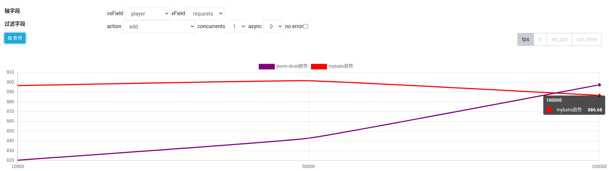

rt: jkorm 略优于 mybatis

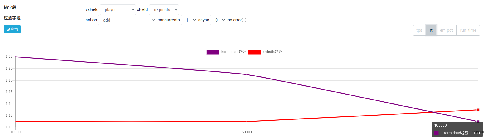

2. `update` 场景

tps: jkorm 略优于 mybatis

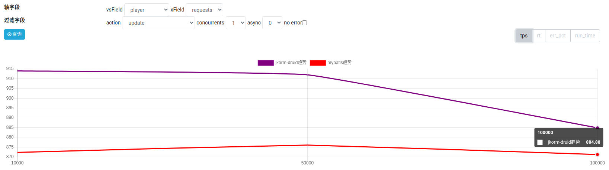

rt: jkorm 略优于 mybatis

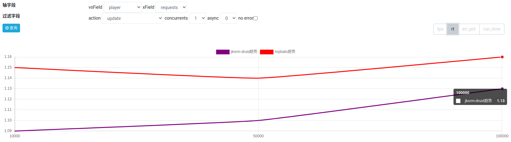

3. `delete` 场景

tps: jkorm 跟 mybatis 差不多

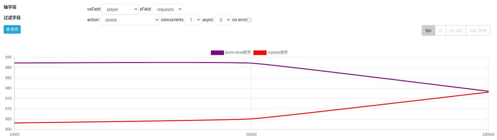

rt: jkorm 跟 mybatis 是一样的, 10w级请求中响应时间都是1.14ms

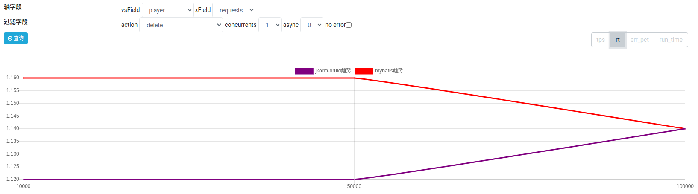

4. `getDepWithEmps` 场景

tps: mybatis 略优于 jkorm

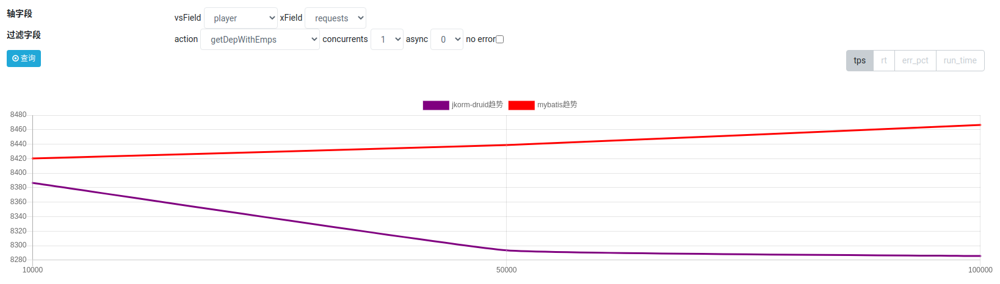

rt: jkorm 跟 mybatis 是一样的, 10w级请求中响应时间都是1.12ms

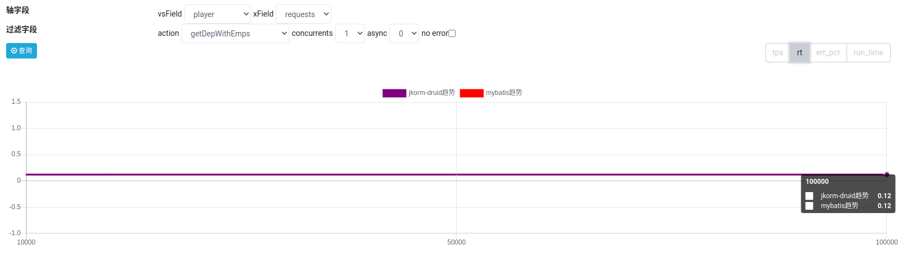

5. `getEmpsByConditionIf` 场景

tps: jkorm 优于 mybatis

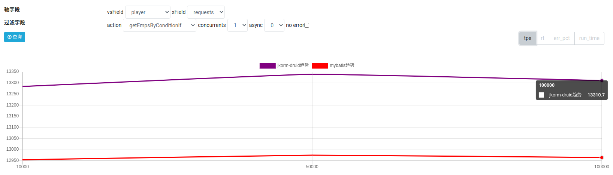

rt: jkorm 优于 mybatis, rt相对降低 12.5%

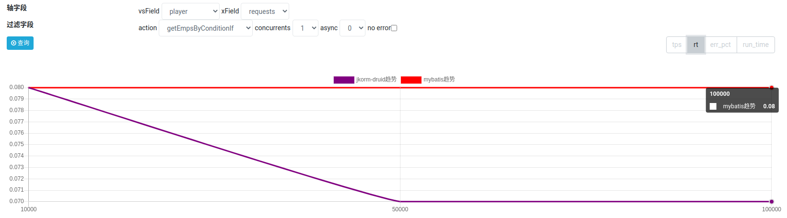

6. `updateEmpOnDynFields` 场景

tps: jkorm 略优于 mybatis

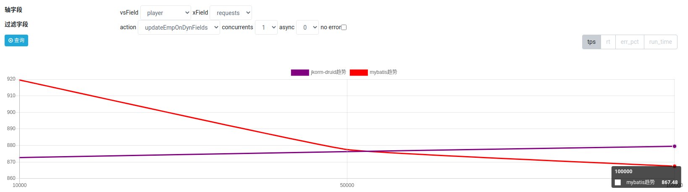

rt: jkorm 略优于 mybatis

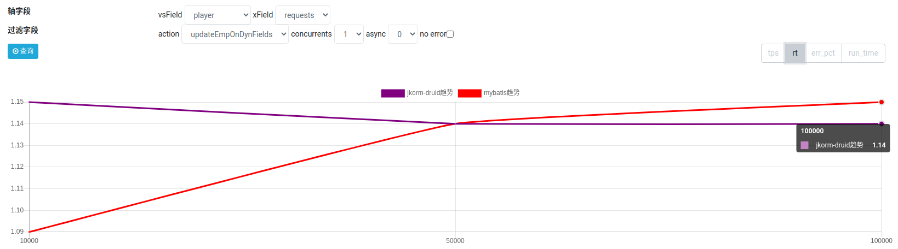

7. `getEmpsByIds` 场景

tps: jkorm 优于 mybatis, tps相对高出 11.24% 

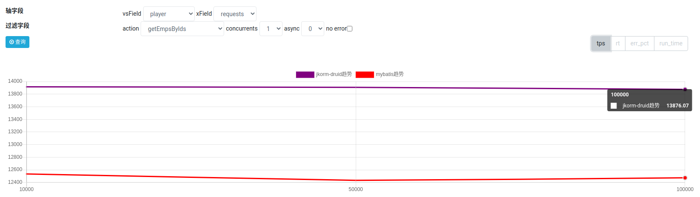

rt: jkorm 优于 mybatis, rt相对降低 12.5%

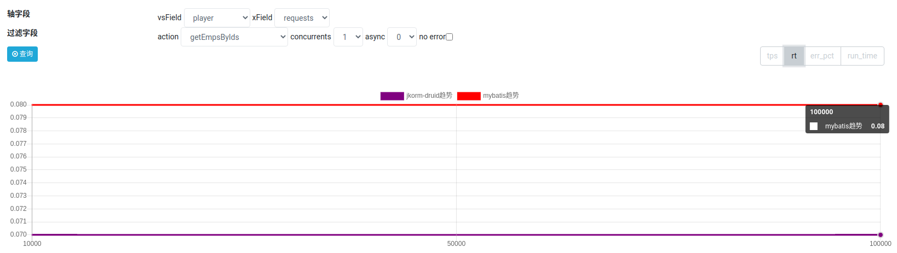


